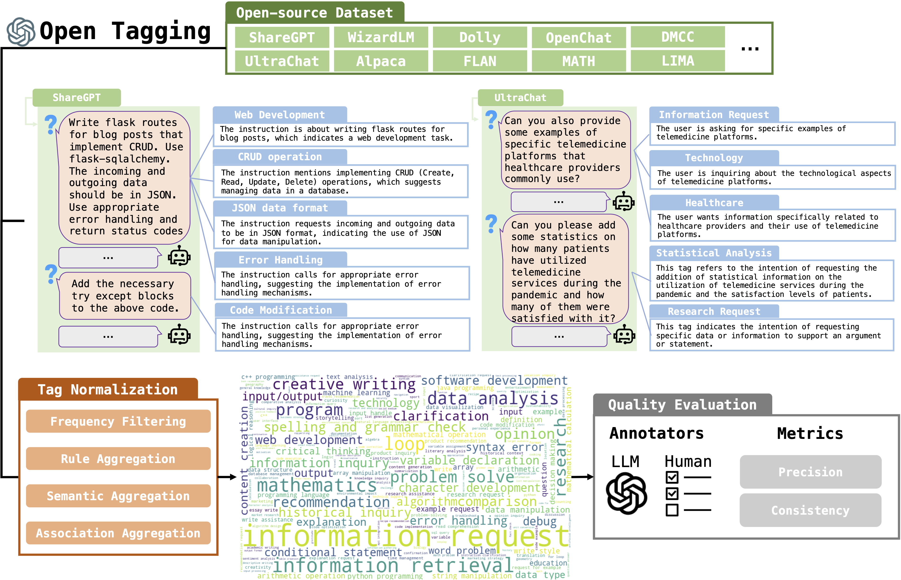

# ****InsTag****: A Tool for Data Analysis in LLM Supervised Fine-tuning


We introduce a tool named **InsTag** for analyzing supervised fine-tuning (SFT) data in LLM aligning with human preference. For local tagging deployment, we release **InsTagger**, fine-tuned on **InsTag** results, to tag the queries in SFT data.
Through the scope of tags, we sample a 6K subset of open-resourced SFT data to fine-tune LLaMA and LLaMA-2 and the fine-tuned models **TagLM-13B-v1.0** and **TagLM-13B-v2.0** outperform many open-resourced LLMs on MT-Bench. 

<p align="center">
🤗 <a href="" target="_blank">InsTagger Checkpoint [WIP]</a> • 👉 <a href="https://www.modelscope.cn/studios/lukeminglkm/instagger_demo/summary" target="_blank">Online LocalTagger Demo</a> • 📖 <a href="https://arxiv.org/pdf/2308.07074.pdf" target="_blank">Paper</a>  <br>
</p>

<p align="center">
🤖️ <a href="" target="_blank">TagLM-13B-v1.0 Checkpoint [WIP]</a> 🤖️ <a href="" target="_blank">TagLM-13B-v2.0 Checkpoint [WIP]</a><br>
</p>


**What is *InsTag*?**

Foundation language models obtain the instruction-following ability through supervised fine-tuning (SFT).
Diversity and complexity are considered critical factors of a successful SFT dataset, while their definitions remain obscure and lack quantitative analyses.
In this work, we propose *InsTag*, an open-set fine-grained tagger, to tag samples within SFT datasets based on semantics and intentions and define instruction diversity and complexity regarding tags.
We obtain 6.6K tags to describe comprehensive user queries.
We analyze popular open-sourced SFT datasets and find that the model ability grows with more diverse and complex data.
Based on this observation, we propose a data selector based on *InsTag* to select 6K diverse and complex samples from open-source datasets and fine-tune models on *InsTag*-selected data.
These models outperform open-source models based on considerably larger SFT data evaluated by MT-Bench, echoing the importance of query diversity and complexity.

<p align="center" width="100%">
<a ></a>
</p>


## News

- - [08/2023] 🔥 We have an online demo of InsTagger hosted by ModelScope. Please refer to the link on the top. Thanks ModelScope!

- [08/2023] 🔥 We released aligned LLMs **TagLM-13B-v1.0** and **TagLM-13B-v2.0** based on LLaMA and LLaMA-2 respectively. Both are fine-tuned on sub-sampled SFT data according to ***InsTag***. Download [v1.0]() and [v2.0](). 

- [08/2023] 🔥 We released an LLM **InsTagger** fine-tuned on our tagging results for local tagging deployments. Download [weight](). 

- [08/2023] 🔥 We introduced ***InsTag***, our SFT data analysis tool. Check out the [paper](). 

## Contents

- [Model Checkpoints](#model-checkpoints)
- [Citation](#citation)

## Model Checkpoints

- **InsTagger** for local query tagging:

    **InsTagger** is an tagging LLM which is fine-tuned on **InsTag**'s tagging results on open-resourced SFT data. The model is based on 7B version LLaMA-2.

    Download the model checkpoint below:

    | Model | Checkpoint | Exact Match F1 | Semantic-based Fuzzy Match F1  | License |
    | ----- |------| -------| -------| ----- |
    | LocalTagger | 🤗 <a href="" target="_blank">HF Link</a>  | **31.8%** | **73.4%**  | <a href="https://ai.meta.com/resources/models-and-libraries/llama-downloads/" target="_blank">LLaMA 2 License </a> |


- **TagLM**, fine-tuned on our SFT data sub-sampled by complexity-first diverse sampling procedure:

    With only 6k data from current open-resourced SFT dataset, **TagLM** can outperform many open-resourced LLMs on MT-Bench using GPT-4 as a judge. 

    Download the model checkpoint below:

    | Model | Checkpoint | MT-Bench  | License |
    | ----- |------| -------| ----- |
    | TagLM-13B-v1.0 | 🤗 <a href="" target="_blank">HF Hub Link</a>  |  **6.44**	  | <a href="https://ai.meta.com/resources/models-and-libraries/llama-downloads/" target="_blank">LLaMA License </a> |
    | TagLM-13B-v2.0 | 🤗 <a href="" target="_blank">HF Hub Link</a>  |  **6.55**	  | <a href="https://ai.meta.com/resources/models-and-libraries/llama-downloads/" target="_blank">LLaMA 2 License </a> |

    All models are either based on LLaMA or LLaMA-2 and should be used under their licenses accordingly. All the models are fine-tuned using [FastCaht](https://github.com/lm-sys/FastChat) codebase, and we apply the system template of Vicuna V1.1. 


## Citation 

Please cite our work if you find the repository helpful.

```
@article{
    xxx,
}
```
